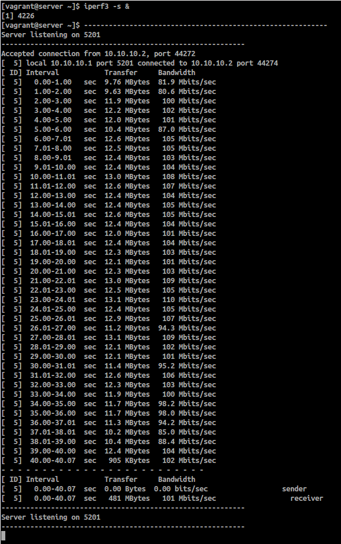
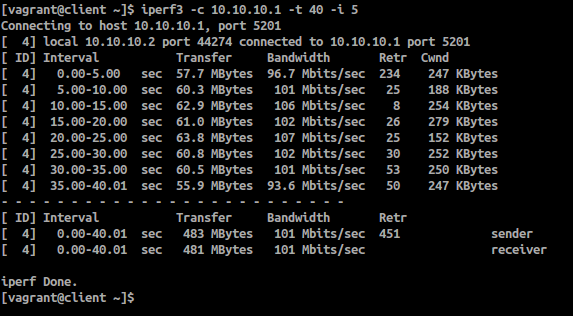
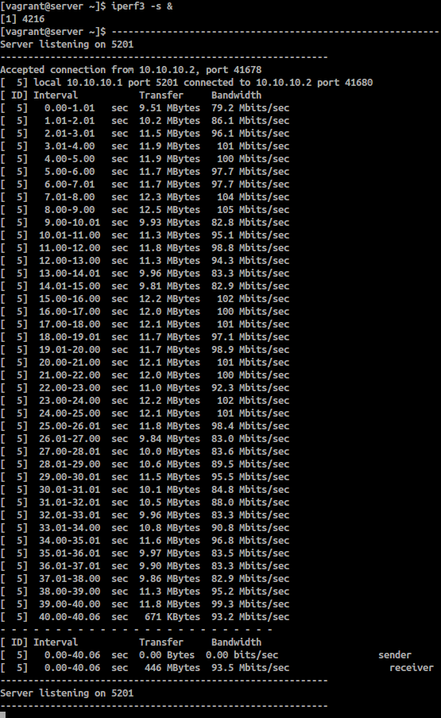
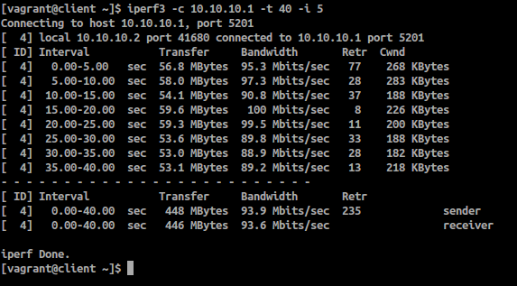
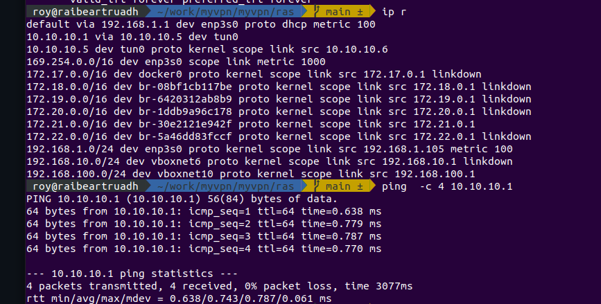

# Задание

Между двумя виртуалками поднять vpn в режимах
tun
tap Прочуствовать разницу.
Поднять RAS на базе OpenVPN с клиентскими сертификатами, подключиться с локальной машины на виртуалку

# Решение
## TUN
- перейдите в каталог tun
- выполните команду ` $ vagrant up   ` 
- после подъема стенда выполнте вход на server и client в отдельных терминалах
     `  $ vagrant ssh client ` 
     `  $ vagrant ssh server ` 
- Проверить, что у нас запущено ` ip tuntap `
- На server запустите приложение iperf3 в режиме сервер  `   $ iperf3 -s & ` 
- На client запустите приложение iperf3 в режиме слиента   `  $ iperf3 -c 10.10.10.1 -t 40 -i 5  ` 
- Результаты теста скорости в режиме работы TUN:

Для перехода к проверке стенда Tap выполните удаления стенда Tun с использованием команды `  $ vagrant destroy -f `  будучи в директории tun

## TAP
- перейдите в каталог tap
- выполните команду `  $ vagrant up   ` 
- после подъема стенда выполнте вход на server и client в отдельных терминалах
     `  $ vagrant ssh client  ` 
     `  $ vagrant ssh server  ` 
- Проверить, что у нас запущено ` ip tuntap `
- На server запустите приложение iperf3 в режиме сервер  `   $ iperf3 -s & ` 
- На client запустите приложение iperf3 в режиме слиента   `  $ iperf3 -c 10.10.10.1 -t 40 -i 5  `       
- Результаты теста скорости в режиме работы TAP:

Для перехода к проверке стенда Ras выполните удаления стенда Tap с использованием команды `  $ vagrant destroy -f `  будучи в директории tap

## RAS
Примечание: На локальной машине требуется пакет openVPN. Убедитесь, что openvpn запущен `sudo service openvpn status` or `sudo systemctl status openvpn`

- перейдите в каталог ras (нам понадобится 2 консоли в этой дирпектории)
- выполните команду `  $ vagrant up   ` 
- На хостовой машине выполните команды для создания ключей сертификата
` ssh-keyscan -H 192.168.100.10 >> ~/.ssh/known_hosts `
` scp root@192.168.100.10:/etc/openvpn/pki/ca.crt ./ `
` scp root@192.168.100.10:/etc/openvpn/pki/issued/client.crt ./ `
` scp root@192.168.100.10:/etc/openvpn/pki/private/client.key ./ `
При запросе пароля, вводить `vagrant`

По итогу в директории RAS будут сгенерированы наши ключи.
- В первой консоли выполните команду: ` sudo openvpn --config client.conf `
- Во второй консоли проверим, что у нас поднялся 10.10.10.1 `ip r`
- и выполните команду: ` ping  -c 4 10.10.10.1 `

Если всё выполнено верно, то мы увидим, что наши "пинги" проходят.

# Документация
1. https://serveradmin.ru/nastroyka-openvpn-na-centos-7/
2. https://eax.me/openvpn/

